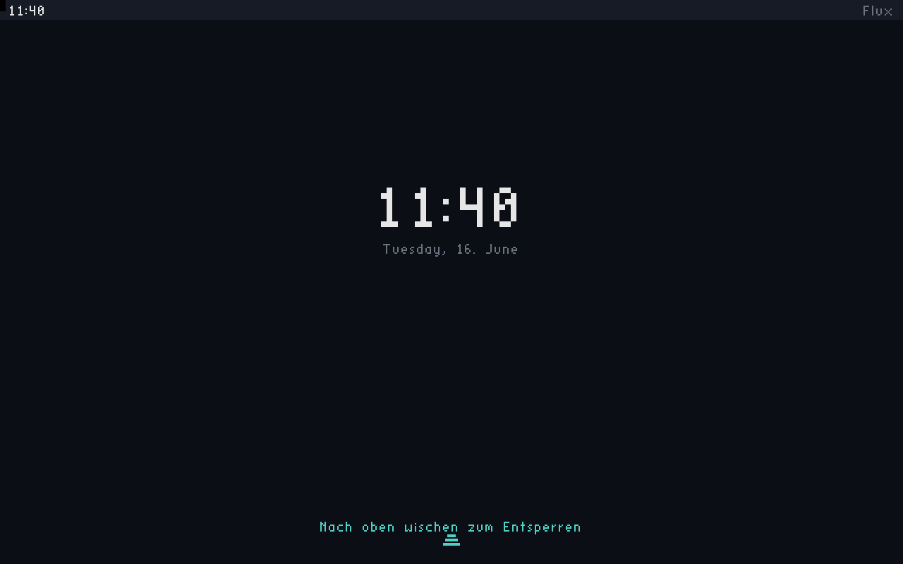
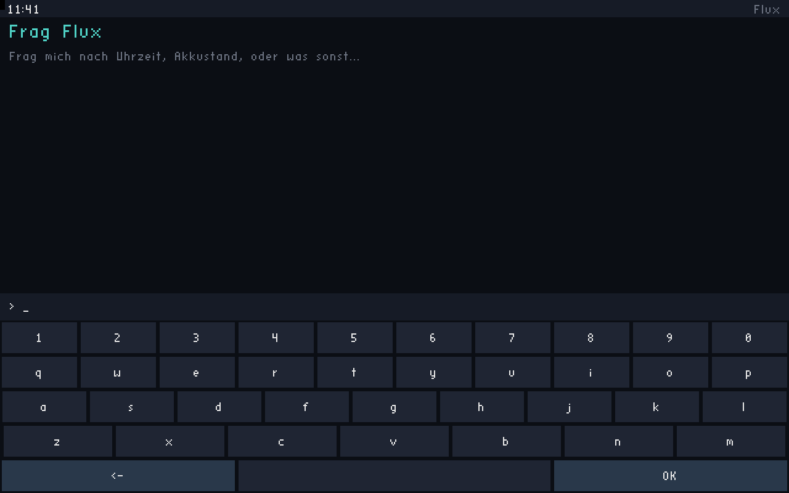
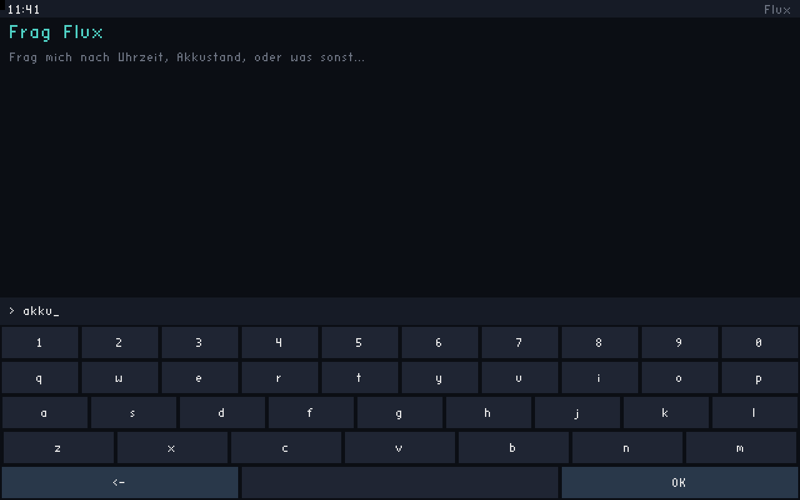
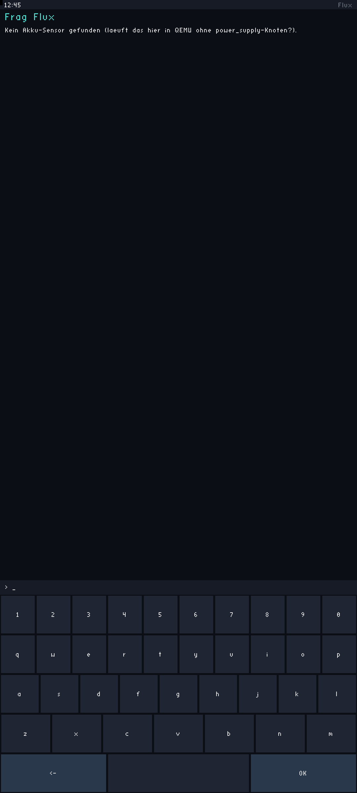
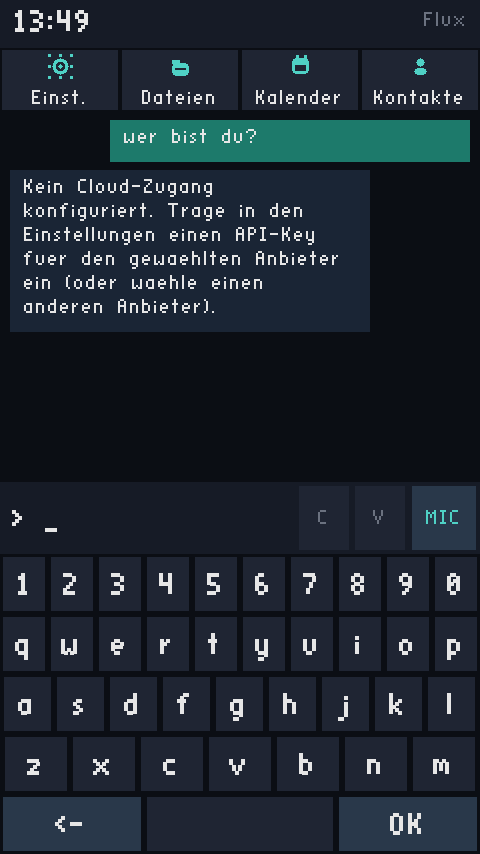

# Flux

Ein mobiles Betriebssystem, das auf KI statt auf einem App-Grid aufbaut.
Kein App-Drawer mit hunderten Icons — der KI-Assistent **ist** der
Homescreen. Man entsperrt das Geraet (optional per PIN-Code) und fragt
direkt, statt zu suchen. Einstellungen und ein Dateibrowser sind ueber
den Assistenten erreichbar (zwei Schnellzugriff-Knoepfe oder Tippen/
Sprechen von "Einstellungen"/"Dateien") -- bewusst kein zweites App-Grid.

Will die KI eine Mail, SMS oder einen Anruf ausloesen, fuehrt sie das
**nie direkt aus**: es kommt immer erst ein Apple-artiger Bestaetigungs-
Dialog (Senden/Abbrechen/Bearbeiten), siehe "KI-Aktionen" unten.

## Verifiziert: echter Boot in QEMU (aarch64), touch-first

Kein Mockup -- das ist ein echter Linux/ARM64-Kernel (Buildroot-gebaut),
der in QEMU bootet, bei dem `flux-shell` auf den von `virtio-gpu`
bereitgestellten Framebuffer zeichnet und `fluxaid` ueber den
Unix-Socket antwortet. Bedienung komplett ohne Tastatur moeglich --
per `virtio-tablet` simuliertem Touch (Wisch-Geste + Bildschirm-
tastatur), Hardware-Tastatur funktioniert weiterhin parallel:

| Lockscreen (Wisch-Hinweis) | Entsperrt per Wisch | Bildschirmtastatur | Lokaler Intent (per Touch) | Ehrlicher Cloud-Hinweis (per Tastatur) |
|---|---|---|---|---|
|  |  |  |  |  |

("Akku" -> kein Sensor in QEMU vorhanden, ehrlich gemeldet statt erfunden,
hier komplett per Touch-Tastatur eingetippt und abgesendet.
"Wer bist du" -> kein `FLUX_AI_API_KEY` gesetzt, ehrlich gemeldet statt
Absturz oder Fantasieantwort, hier per Hardware-Tastatur gestellt.)

---

## Ehrliche Einordnung (bitte zuerst lesen)

"Besser als Android und iOS" ist als wortwoertliches Versprechen nicht
seriös erfüllbar — diese Systeme sind das Ergebnis von tausenden
Personenjahren Arbeit an Hardware-Treibern, Funkstacks, Sicherheits-
Sandboxing und App-Oekosystemen. Flux faengt nicht bei null an (kein
eigener Kernel, kein eigener Funkstack), sondern baut bewusst auf dem
**Linux-Kernel** auf — so wie Android das auch tut, und so wie es jedes
realistische Hobby-/Indie-Mobile-OS macht (siehe postmarketOS, SailfishOS,
Plasma Mobile). Der Linux-Kernel bringt echte Geraetetreiber,
Speicherverwaltung und Multitasking mit, die niemand sinnvoll von Grund
auf neu schreibt.

**Was an Flux tatsaechlich eigen ist:** die komplette UI- und KI-Schicht
oberhalb des Kernels. Kein Android-Userspace, keine Java/Kotlin-VM, keine
App-Sandbox-Architektur von Google. Stattdessen: ein eigener,
ressourcenschonender Daemon, der KI-Antworten direkt ins Betriebssystem
einbaut, und eine eigene, in C geschriebene Shell, die direkt auf den
Framebuffer zeichnet.

Aktuell lauffaehig: **QEMU `aarch64 virt`** (generische ARM64-Plattform).
Lauffaehig auf echter Telefon-Hardware ist ein eigener, deutlich
groesserer Schritt (Geraetebaum/Treiber fuer genau dein Zielgeraet,
Touchscreen-Kalibrierung, Modem/RIL, Akku-Management) — siehe Roadmap.

---

## KI-Aktionen: Mail, SMS, Anruf (Bestaetigungs-Dialog)

Erkennt `fluxaid` in einer Antwort einen klaren Auftrag ("schreib eine
Mail an...", "ruf... an"), antwortet es mit einem strukturierten
`ACTION:`-Block statt nur Text (`fluxai/src/provider.c`, System-Prompt).
`flux-shell` parst das (`shell/src/action.c`) und zeigt **immer** erst
den Bestaetigungs-Dialog -- drei grosse Knoepfe: Senden, Abbrechen,
Bearbeiten (Text vor dem Senden aendern). Erst ein Tap auf "Senden"
schickt eine `X:`-Ausfuehr-Anfrage an `fluxaid`. Die KI fuehrt nie etwas
direkt aus.

**Mail funktioniert wirklich:** `fluxaid` verschickt sie per SMTP
(`fluxai/src/mail.c`, libcurl). Host/Port/Benutzer/Passwort/Absender
werden in den Einstellungen hinterlegt (siehe unten) -- ohne Konfiguration
gibt es eine ehrliche Fehlermeldung statt eines stillen Fehlschlags.

**SMS und Anruf sind ehrliche Stubs:** QEMU `virt` hat kein Mobilfunk-
Modem und kein eSIM -- diese Hardware existiert in der virtuellen
Maschine schlicht nicht. `fluxai/src/telephony.c` meldet das wahrheits-
gemaess ("kein Modem erkannt") statt einen Erfolg zu erfinden, exakt das
gleiche Prinzip wie beim fehlenden Akku-Sensor. Die Datei ist bewusst als
austauschbares Backend geschnitten: auf echter Hardware mit
ofono/ModemManager ersetzt eine neue Implementierung nur diese eine
Datei, Protokoll und UI bleiben unveraendert.

## Einstellungen & Dateien

- **Einstellungen** (`FLUX_SCREEN_SETTINGS`): PIN-Code, SMTP-Zugangsdaten,
  Absenderadresse, Cloud-API-Key. Geheimnisse (PIN, SMTP-Passwort,
  API-Key) werden in der Liste nur als "gesetzt"/"********" angezeigt,
  nie im Klartext. Gespeichert in `/etc/flux/flux.conf` (`chmod 0600`,
  siehe Sicherheits-Hinweis).
- **Dateien** (`FLUX_SCREEN_FILES`): einfacher Read-Only-Browser (rein/
  raus navigieren, Ordner/Dateigroessen anzeigen). Bewusst kein Loeschen/
  Umbenennen -- ein erster sicherer Schritt, kein vollwertiger
  Datei-Manager.

## Mikrofon-Knopf (Whisper) -- aktuell ein ehrlicher Platzhalter

Der Assistent hat einen Mikrofon-Knopf neben der Eingabezeile. QEMU
`virt` hat aktuell **kein Audiogeraet** -- es gibt nichts, von dem echte
Sprache aufgenommen werden koennte. Ein Tap meldet das ehrlich ("kein
Mikrofon erkannt") statt eine Aufnahme zu simulieren. Geplant: lokales
`whisper.cpp` (kein Cloud-Whisper, Privacy-Grund wie beim Rest des
Systems) -- braucht zuerst ein virtuelles Audiogeraet in der QEMU-Konfig
und ein gebuendeltes Modell im Rootfs-Overlay, siehe Roadmap.

## Flugmodus per KI ("aktivier Flugmodus")

Der Assistent kann den Flugmodus ueber das KI-Tool `flight_mode` schalten
und abfragen ("aktivier Flugmodus", "Funk wieder an", "ist Flugmodus an?").
Backend ist die Linux-`rfkill`-Schnittstelle (`fluxai/src/radio.c`): ein
einzelnes `RFKILL_OP_CHANGE_ALL`-Event blockt bzw. entsperrt alle
Funkmodule (WLAN/Bluetooth/Mobilfunk) auf einmal.

Ehrlich: QEMU `virt` hat **keine Funkhardware** und damit kein
`/dev/rfkill` -- dort meldet das Tool wahrheitsgemaess "Keine Funkhardware
erkannt" statt einen Erfolg zu erfinden (gleiches Prinzip wie beim
Modem-Stub und beim fehlenden Akku-Sensor). Auf echter Hardware mit
rfkill-faehigen Funkmodulen schaltet derselbe Code real -- `radio.c` ist
als austauschbares Backend geschnitten, das spaeter z.B. gegen
NetworkManager/ofono getauscht werden kann, ohne Tool oder UI zu aendern.
Verifiziert ist bisher der ehrliche Fallback-Pfad (Host ohne `/dev/rfkill`)
und der Host-Compile-Test; der echte rfkill-Schaltpfad ist erst auf
Hardware/QEMU mit Funkmodulen ausfuehrbar.

---

## Architektur

```
┌─────────────────────────────────────────────┐
│  flux-shell (eigene UI, kein App-Grid)       │  <- zeichnet direkt auf
│  Lock -> (PIN) -> Assistent (Homescreen)     │     /dev/fb0 (Framebuffer,
│  -> Bestaetigung/Bearbeiten/Einstellungen/   │     Double-Buffering)
│     Dateien -- alles vom Assistenten aus     │
└───────────────────┬───────────────────────────┘
                    │ Unix-Socket (/run/flux/fluxai.sock)
                    │ Q:<frage>  oder  X:<aktion> (nach Bestaetigung)
┌───────────────────┴───────────────────────────┐
│  fluxaid (System-KI-Daemon, kein App-Prozess)│  <- lokale Intents zuerst
│  - lokale Intents: Uhrzeit, Akku, Uptime ...  │     (Geschwindigkeit +
│  - Cloud-Fallback ueber eigenen API-Key       │     Privacy), Cloud nur
│  - Aktionen: Mail (SMTP, echt) / SMS+Anruf    │     wenn wirklich noetig
│    (ehrlicher Modem-Stub, siehe oben)         │
└───────────────────┬───────────────────────────┘
                    │
┌───────────────────┴───────────────────────────┐
│  Linux-Kernel (Buildroot, aarch64)            │  <- Treiber, Speicher,
│  virtio-gpu/DRM, virtio-input, ext4           │     Multitasking: nicht
└─────────────────────────────────────────────┘     selbst geschrieben
```

**Warum kein App-Grid?** Das ist die eigentliche Differenzierung zu
Android/iOS, nicht ein technisches Detail. Die zentrale Interaktion ist
eine Frage in natuerlicher Sprache statt "welches Icon tippe ich an".

**Warum Framebuffer statt Wayland/eines Compositors?** Fuer den Prototyp
ist das die einfachste Schicht, die wirklich ruckelfrei laeuft (siehe
"Performance" unten). Ein echter Compositor (fuer mehrere Fenster,
Animationen, GPU-Beschleunigung) ist ein spaeterer Roadmap-Schritt — aber
genau wie beim x86-Kernel-Vorlaeufer-Projekt gilt: erst die unterste
Schicht zum Laufen bringen, dann ausbauen.

---

## Performance ("es muss fluessig laufen")

Das war explizite Vorgabe, deshalb bewusste Entscheidungen dafuer:

- **C statt Electron/JS/Flutter** fuer Shell und Daemon — keine VM, kein
  Garbage Collector, kein Rendering-Framework-Overhead.
- **Double-Buffering + Dirty-Row-Tracking** im Framebuffer-Code
  (`shell/src/fb.c`): jeder Frame landet zuerst im RAM-Backbuffer; beim
  Praesentieren wird nur kopiert, was sich seit dem letzten Frame
  tatsaechlich geaendert hat (`flux_fb_present`). Eine Uhr, die sich
  einmal pro Sekunde aendert, kostet keine 60 Vollbild-Kopien pro Sekunde.
- **Lokale Intents ohne Netzwerk-Roundtrip** (`fluxai/src/actions.c`):
  "Wie spaet ist es" oder "Akkustand" werden direkt im Daemon beantwortet,
  ohne auf eine Cloud-API zu warten — das ist nicht nur schneller,
  sondern verlaesst das Geraet nie (Privacy by construction, wie schon im
  Vorlaeufer-Projekt angestrebt).
- **Kein Re-Parsing/Re-Layout bei jedem Tastendruck**: nur das geaenderte
  UI-Element wird neu gezeichnet, der Rest bleibt im Backbuffer stehen.

Ehrlich: echte 60-fps-Animationen brauchen GPU-Compositing (DRM/KMS statt
rohem Framebuffer) — das ist ein Roadmap-Punkt, kein Tag-1-Feature. Was
heute schon stimmt: keine Komponente der Software-Architektur erzeugt
unnoetige Arbeit, die spaeter wieder rausoptimiert werden muesste.

---

## Projektstruktur

```
Flux/
├── shell/              flux-shell -- Framebuffer-UI
│   └── src/
│       ├── fb.c/.h          Framebuffer + Double-Buffering
│       ├── stb_easy_font.h  Public-Domain-Bitmapfont (nothings/stb)
│       ├── input.c/.h       Tastatur/Touch ueber Linux evdev
│       ├── ipc.c/.h         Client fuer fluxaid (Q:/X:-Anfragen)
│       ├── action.c/.h      Parst ACTION:-Vorschlaege, baut X:-Anfragen
│       ├── ui.c/.h          Alle Bildschirme (Lock/PIN/Assistent/
│       │                    Bestaetigung/Bearbeiten/Einstellungen/Dateien)
│       └── main.c           Event-Loop / Zustandsmaschine
├── fluxai/              fluxaid -- System-KI-Daemon
│   └── src/
│       ├── actions.c/.h     Lokale Geraete-Intents (Zeit, Akku, Uptime)
│       ├── provider.c/.h    Cloud-Fallback (Anthropic API, eigener Key)
│       ├── exec.c/.h        Fuehrt bestaetigte Aktionen aus (X:-Anfragen)
│       ├── mail.c/.h        Echter SMTP-Versand (libcurl)
│       ├── telephony.c/.h   SMS/Anruf -- ehrlicher Modem-Stub, austauschbar
│       └── main.c           Unix-Socket-Server
├── common/
│   ├── flux_protocol.h      Mini-Protokoll Shell <-> Daemon (Q:/X:/ACTION:)
│   ├── flux_config.c/.h     Gemeinsame Konfigdatei (/etc/flux/flux.conf)
│   └── flux_sha256.c/.h     SHA-256 fuer den PIN-Hash
├── build/
│   ├── overlay/              Rootfs-Overlay (eigenes /etc/inittab, Binaries)
│   └── build.sh              Buildroot-Build + Cross-Compile in einem Schritt
└── docs/
    └── ARCHITECTURE.md
```

---

## Bauen & Starten

### Schnelltest auf dem Host (ohne echtes Geraet/QEMU)
```bash
cd fluxai && make && ./fluxaid &     # Daemon starten
cd ../shell && make                  # nur Compile-Test, /dev/fb0 fehlt auf dem Host
```

### Vollstaendiges Image fuer QEMU aarch64
Baut Linux-Kernel + Rootfs (Buildroot) und kompiliert flux-shell/fluxaid
mit dem dabei erzeugten Cross-Compiler. Dauert beim ersten Mal lange
(Toolchain + Kernel werden von Grund auf gebaut).
```bash
./build/build.sh
```
Start in QEMU (Grafikfenster + virtuelle Tastatur):
```bash
./build/run-qemu.sh
```

### Eigenen KI-Zugang einrichten (optional)
Ohne API-Key beantwortet `fluxaid` nur lokale Fragen (Zeit, Akku, Uptime)
und sagt ehrlich, dass kein Cloud-Zugang konfiguriert ist.

**KI-Anbieter waehlbar.** Flux unterstuetzt mehrere vorkonfigurierte
Anbieter; der aktive wird in den Einstellungen unter **KI-Anbieter** per
Tipp durchgeschaltet (Anthropic → DeepSeek → NVIDIA). API-Key und Modell
darunter beziehen sich immer auf den gerade gewaehlten Anbieter:

| Anbieter | Format | Endpunkt | Standardmodell |
|---|---|---|---|
| Anthropic Claude | Messages API (+ Prompt-Caching) | `api.anthropic.com` | `claude-haiku-4-5-20251001` |
| DeepSeek | OpenAI-kompatibel | `api.deepseek.com` | `deepseek-chat` |
| NVIDIA NIM | OpenAI-kompatibel | `integrate.api.nvidia.com` | `meta/llama-3.1-8b-instruct` |

Konfiguriert wird ueber die Einstellungen oder direkt in
`/etc/flux/flux.conf`:
```ini
ai_provider=deepseek          # anthropic | deepseek | nvidia
api_key=...                   # Anthropic-Key
deepseek_key=...              # DeepSeek-Key
nvidia_key=...                # NVIDIA-NIM-Key
anthropic_model=...           # optional, sonst Standardmodell
deepseek_model=...            # optional
nvidia_model=...              # optional
```
Alternativ per Umgebungsvariable (`FLUX_AI_API_KEY`, `DEEPSEEK_API_KEY`,
`NVIDIA_API_KEY`). Bei Rate-Limits (HTTP 429, z.B. NVIDIA) wiederholt
`fluxaid` die Anfrage automatisch mit kurzem Backoff.

### E-Mail einrichten (Senden + Lesen)
In den Einstellungen gibt es **einen** Eintrag „E-Mail Einstellungen": dort
nur die **E-Mail-Adresse** und das **App-Passwort** eingeben. SMTP- und
IMAP-Server samt Ports werden automatisch aus der Domain abgeleitet
(Gmail, Outlook/Hotmail, iCloud, Yahoo, GMX, web.de, t-online, posteo,
mailbox.org; bei unbekannten Domains `smtp.<domain>` / `imap.<domain>`).

Damit kann `fluxaid` Mails senden (SMTP) und ungelesene Mails abrufen
(IMAP), sodass die KI sie zusammenfassen kann („Fasse meine ungelesenen
Mails zusammen"). KI-Tools: `mail_unread` (Kopfzeilen ungelesener Mails) und
`mail_read` (Text einer Mail per UID, setzt das \Seen-Flag nicht).

Wer die Felder lieber direkt setzt, kann das weiterhin in
`/etc/flux/flux.conf` tun (`smtp_host/port/user/pass/from`,
`imap_host/port/user/pass`).

### Web-Suche (SearXNG, optional)
Die KI-Anbieter (DeepSeek/NVIDIA/Anthropic) suchen über die API **nicht**
selbst im Netz. Flux bringt dafür ein eigenes, anbieter-unabhängiges Tool
`web_search` mit, das eine **eigene SearXNG-Instanz** abfragt — bewusst
selbst gehostet (eigener Index, keine Profilbildung, kein API-Key im Gerät).

Empfohlenes Setup: SearXNG läuft auf dem **MacBook** (Backend), das Flux-Gerät
fragt es im selben Netz ab.

1. SearXNG auf dem MacBook starten (am einfachsten via Docker):
   ```bash
   docker run --rm -p 8888:8080 -v ./searxng:/etc/searxng searxng/searxng
   ```
2. In `searxng/settings.yml` das **JSON-Format aktivieren** (sonst antwortet
   SearXNG mit HTTP 403):
   ```yaml
   search:
     formats:
       - html
       - json
   ```
3. In Flux unter **Einstellungen → „Web-Suche (SearXNG)"** die URL eintragen,
   z. B. `http://macbook.local:8888` (oder die IP des MacBooks). Direkt in
   `/etc/flux/flux.conf`: `searxng_url=http://macbook.local:8888`.

Danach kann jeder KI-Anbieter über `web_search` aktuelle Infos holen
(„Suche im Internet nach …"). Später lässt sich dieselbe Konfiguration auf
einen produktiven SearXNG-/Such-Proxy umstellen, ohne Code-Änderung.

---

## Roadmap

1. ~~Framebuffer-UI mit Double-Buffering~~
2. ~~System-KI-Daemon mit lokalen Intents + Cloud-Fallback~~
3. ~~Bootbares aarch64-Image (Buildroot, QEMU `virt`)~~
4. ~~Touch-Input statt nur Tastatur~~ -- Wisch-Geste zum Entsperren,
   Bildschirmtastatur fuer den Assistenten, Hardware-Tastatur bleibt
   nebenbei nutzbar (`shell/src/input.c`, `shell/src/ui.c`)
5. ~~PIN-Sperre, Einstellungen, Dateibrowser, KI-Aktionen mit
   Bestaetigungs-Dialog, echte SMTP-Mail~~ (siehe oben)
6. Lokales `whisper.cpp` fuer den Mikrofon-Knopf -- braucht zuerst ein
   virtuelles Audiogeraet in `build/run-qemu.sh` (aktuell keins
   vorhanden) und ein gebuendeltes Modell im Rootfs-Overlay
7. Echtes Modem-Backend (ofono/ModemManager) fuer SMS/Anruf auf echter
   Hardware -- ersetzt nur `fluxai/src/telephony.c`, siehe oben
8. Stimm-Erkennung als zweiter Entsperr-Faktor (statt/zusaetzlich zum
   PIN) -- bewusst nicht implementiert, siehe Hinweis direkt darunter
9. Echter Compositor (DRM/KMS, GPU-Beschleunigung, Animationen, mehrere
   "Karten" statt nur Lockscreen+Assistent)
10. Benachrichtigungen als eigener Systemdienst (nicht App-spezifisch)
11. Portierung auf ein konkretes echtes Geraet (Geraetebaum, Touchscreen-
    Treiber, Akku/Power-Management) — das ist der Schritt, der "Telefon"
    ernst nimmt, siehe postmarketOS-Doku zum Geraete-Porting
12. Sicherheitsmodell fuer Drittanbieter-Apps (Sandbox/Permissions) --
    aktuell laeuft alles als root, das ist fuer einen Dev-Build okay, fuer
    ein echtes Telefon-Betriebssystem nicht

### Hinweis zu Stimm-Entsperrung (Punkt 8)

Sprecher-Verifikation ist ein eigenes, nicht-triviales ML-Problem (nicht
einfach "Whisper transkribiert Text und vergleicht ihn") und sollte nie
die *einzige* Schranke sein -- Stimmen lassen sich aufnehmen/synthetisieren,
und ein Mikrofonausfall darf nicht zum Komplett-Lockout fuehren. Realistischer
Ansatz: Sprecher-Embedding-Modell (z.B. ein kompaktes ECAPA-TDNN/x-vector-
Modell) lokal ausfuehren, Aehnlichkeit zu einem beim Einrichten aufgenommenen
Referenz-Embedding pruefen, und das **immer** nur als zweiten Faktor neben
dem PIN anbieten, nie als alleinigen. Das ist deutlich mehr Infrastruktur
(Mikrofon in QEMU, Embedding-Modell, sicherer Speicherort fuer das
Referenz-Embedding) als der aktuelle Funktionsumfang -- bewusst nicht in
dieser Iteration umgesetzt.

## Sicherheits-Hinweis (Dev-Build)
Das gebaute Image hat einen Root-Login ohne Passwort auf der seriellen
Konsole und keine App-Sandbox -- das ist ein bewusster Kompromiss fuer
einen Entwicklungs-/Demo-Build, kein produktionsreifes Sicherheitsmodell.
`/etc/flux/flux.conf` (PIN-Hash, SMTP-Zugangsdaten, Cloud-API-Key) liegt
unverschluesselt, nur per `chmod 0600` geschuetzt -- kein Ersatz fuer
einen echten Secret-Store. Vor jedem Schritt in Richtung "echtes Geraet"
muss das ueberarbeitet werden.
